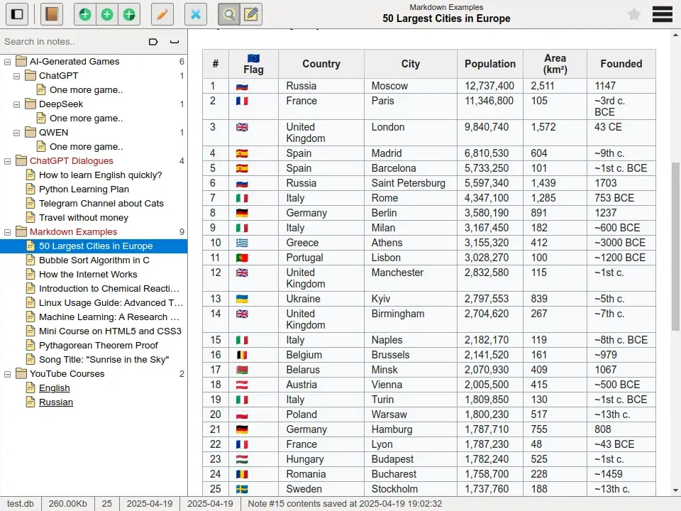
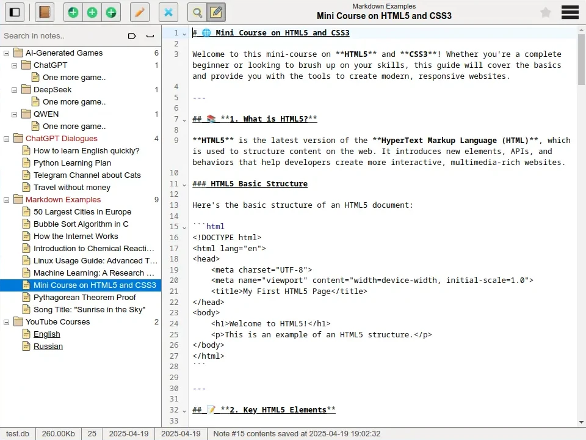

# Tetrad

Tetrad is a minimalistic Markdown note-taking application. Built as a local-first web app with Go backend and Vue.js frontend.

> This is my first project using Go, TypeScript, and Vue. I appreciate any feedback or suggestions!

## Features

- Tree-style note organization
- Markdown support (with live preview)
- Note creation, editing, and deletion
- SQLite-based storage
- Lightweight and self-hostable
- Basic multilanguage support

## Tech Stack

- **Backend:** Go (`gorilla/mux`, `mattn/go-sqlite3`, `gorm.io/gorm`)
- **Frontend:** Vue 3 + pinia + TypeScript + Vite + CodeMirror + MarkdownIt + highlight.js
- **Database:** SQLite

## Installation

### Prerequisites

- Go >= 1.24.1
- npm
- Android NDK for cross-compiling to android/arm64

### Build steps

1. Clone the repository:
```bash
git clone https://github.com/sondrus/tetrad  
cd tetrad
```

2. Install dependencies:
```bash
make deps
```

1. Compile and run:
```bash
make
```

By default, the application will run on http://localhost:8888.

### Prebuilt binaries

You can also download a precompiled binary that runs without any dependencies:  
[Releases](https://github.com/sondrus/tetrad/releases)

## Configuration

The following command-line flags are available:

- `--host`: host name to bind to (default: `localhost`, e.g. `0.0.0.0`)
- `--port`: port number (default: `8888`)
- `--database`: path to SQLite database file (default: `~/.tetrad/database.db`)

## Screenshots




## License

MIT

## Contributing

Pull requests are welcome. Please open an issue first to discuss changes.
